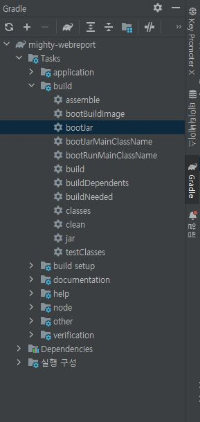

<h1>MIGHTY WebReport Project</h1>

<h2>Index</h2>

- <a href="#gettingStarted">Getting Started</a>
  * <a href="#개발환경">개발환경</a>
  * <a href="#개발가이드">개발 가이드</a>
  * <a href="#dataBase">DataBase</a>
- <a href="#description">Description</a>
  * <a href="#projectPeriod">Project Period</a>
  * <a href="#projectPurpose">Project Purpose</a>
  * <a href="#projectArchitecture">Project Architecture</a>
- <a href="#skill">Skill</a>
- <a href="#run">Run</a>
  * <a href="#프로젝트실행">프로젝트 실행</a>
  * <a href="#reactLiveServer">React Live Server</a>
- <a href="#deploy">Deploy</a>
  * <a href="#intellijUltimateJar배포">Intellij Ultimate jar 배포</a>
  * <a href="#cmdJar배포">cmd jar 배포</a>
  * <a href="#jar파일실행">jar 파일 실행</a>
- <a href="#developerContact">Developer Contact</a>

<h2 id="gettingStarted">Getting Started</h2>

<h3 id="개발환경">개발환경</h3>

- 추천IDE - <a href="https://www.jetbrains.com/ko-kr/idea/download/#section=windows">인텔리제이</a>

인텔리제이는 java와 React 개발에 편리한 plugin들이 많고 가장 자동완성을 잘 지원해주며,<br/>
요즘 웹개발에선 가장 좋다고 불리오는 IDE 입니다.<br/>
빌드 환경이나 live server , 심지어 소스 관리(git, svn 등..) 도 가장 편리하게 지원해주는 IDE 입니다.<br/>
하지만 무료버전과 유료버전이 지원하는 차이가 있어서 무료버전을 사용할 경우 불편함이 있을 수 있습니다.<br/>

- 추천IDE2 - <a href="https://www.eclipse.org/downloads/">이클립스</a>

이클립스는 가장 대표적인 웹개발 무료 IDE로 모든언어를 지원해줍니다.<br/>
Back-End 개발은 정말 편리하게 사용할 수 있으나, Front-End쪽 개발이 상당히 불친절합니다.<br/>
React js , typescript의 자동완성이나 컴파일에러를 발견하기 조금 더 까다롭습니다.<br/>
따라서 이 경우에는 <a herf="https://code.visualstudio.com/download">VSCode</a>를 활용해서 Front-End 개발을 따로 하는편이 좀더 편리합니다.

- <a href="https://nodejs.org/ko/download/">Node.js</a>

React 개발을 위해선 nodejs를 설치해야만 합니다. cmd를 키고 아래 명령어를 입력해보세요.
```
    $ npm --version
```
버전이 나온다면 넘어가시고, <br/>
찾을수 없는 명령어라고 나온다면 위의 링크를 통해 LTS 버전을 다운로드 받아주세요.

<h3 id="개발가이드">개발 가이드</h3>

- Front-End는 frontend 디렉토리의 <a href="/frontend/">README.md</a> 참고
- Back-End는 src/main/java/com/mighty/webreport 디렉토리의 <a href="/src/main/java/com/mighty/webreport/">README.md</a> 참고

<h3 id="dataBase">DataBase</h3>

- /src/main/resources 디렉토리에 security.properties 파일 생성
```properties
jwt.secretKey = 문자열 아무렇게나
jwt.expireMs = 864000000

spring.datasource.driverClassName = oracle.jdbc.OracleDriver
spring.datasource.url = jdbc:oracle:thin:@ip주소:포트번호:서비스 이름
spring.datasource.username = 아이디
spring.datasource.password = 비밀번호
```
jwt.secretKey는 100자 이상의 영어 소,대문자와 숫자로 구성해주시면 됩니다.<br/>
jwt.expireMs는 로그인 유지시간으로 <br/>
1000이 1초, 3,600,000이 1시간 , 86,400,000이 하루입니다.<br/>
위의 예시는 10일동안 로그인이 유지되는 토큰을 발급해줍니다.<br/>


<h2 id="description">Description</h2>

<h3 id="projectPeriod">Project Period</h3>
2022.05.09(월) ~ 2022.06.17(금) (약 5주간)

<h3 id="projectPurpose">Project Purpose</h3>
기존의 Web Report 보다 사용자 친화적, 속도향상, 보안강화를 목적에 두고 있습니다.

1. 보안강화 : 기존의 사이트는 비밀번호를 사용자(client)단에서 encode 하여 서버에 보내줍니다. 이 과정에서 xss가 일어날 가능성이 있고, 또한 web secure가 되어있지 않아 csrf 요청에도 취약합니다. 이러한 점을 csrf에는 완전 안전, xss에는 보다 안전한 방식으로 업그레이드 합니다.

2. 트래픽 감소 : session 방식에서 token 인증방식으로 바꾸면서 요청횟수를 줄이고,
   뿐만 아니라 데이터를 React Store기능을 활용하여 서버가 아닌 사용자(client)단에
   보관하게 하여 서버의 부담을 줄이고, 속도 향상하는 방식입니다.

3. UI/UX 업그레이드 : SPA(Single Page Aplication) 방식으로 핸드폰 어플리케이션과 같이 깜빡임이 존재하지 않고, 페이지가 좀더 부드러워 집니다.
   거기에 더해 페이지 전반적으로 사용하기 편하게 업그레이드 합니다.

<h3 id="projectArchitecture">Project Architecture</h3>

<h2 id="skill">Skill</h2>

<h3>Front-End</h3>
<div>


</div>

<h3>Back-End</h3>
<div>


</div>

<h3>DataBase</h3>
<div>

</div>

<h2 id="run">Run</h2>

<h3 id="프로젝트실행">프로젝트 실행</h3>

- gradle.build 빌드

- 프로젝트 빌드

- /src/main/java/com/mighty/webreport의 MightyWebreportApplication 파일 실행

<h3 id="reactLiveServer">React Live Server</h3>

터미널에서 아래 커맨드 입력

```
    $ cd /frontend
    $ npm install
    $ npm start
```

<h2 id="deploy">Deploy</h2>

<h3 id="intellijUltimateJar배포">Intellij Ultimate jar 배포</h3>

배포를 하는방법은 Intellij Ultimate IDE를 기준으로는 우측의 gradle 버튼에서<br />
build bootJar로 빌드하거나 (이미지 참조)<br/>
<br/>

<h3 id="cmdJar배포">cmd jar 배포</h3>
터미널에서 프로젝트 루트위치로 가서 아래 커맨드 입력

```
    $ gradlew bootJar
```

그 후 /build/libs 디렉토리에 .jar 파일이 생성된다.<br/>
이파일을 배포시키면 완료

<h3 id="jar파일실행">jar 파일 실행</h3>

- CLI 실행 (Logger 실시간 확인, 및 debug 용)

```
    $ java -jar build.libs에 생성된파일.jar
```

- BackGround 실행

```
    $ javaw -jar build.libs에 생성된파일.jar
```

- BackGround 종료

```
    $ taskkill /f /im javaw.exe
    $ taskkill /f /im java.exe
```

<h2 id="developerContact">Developer Contact</h2>

- 이메일 링크 : <yyj161091@gmail.com>

- github 링크 : <https://github.com/show5116>

- 핸드폰 : 010-5116-1830
